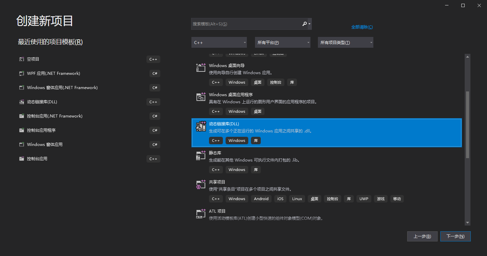
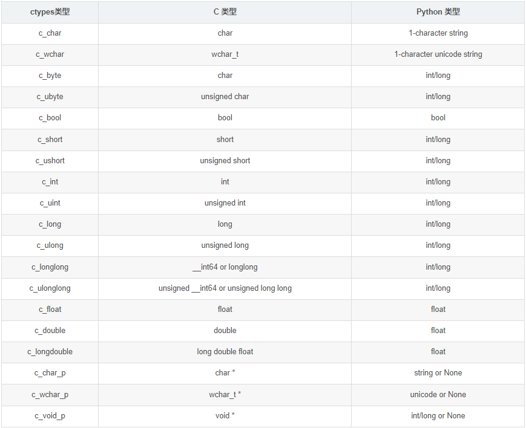

# Matlab/Python与C语言混编，写得快跑得快
# 应用场景
&emsp;对于Python来说，通过Numpy可以调用blas或者其他底层来实现高效的矩阵计算，而Matlab天生就是用来做矩阵计算的，底层通过oneMKL实现。在默认的情况下，通过Matlab做复杂的矩阵运算会比其他的语言要快。如果简单测试Matlab实现的矩阵计算与通过基于blas的C++ Eigen实现矩阵计算，可以发现Matlab比C++还要快一点。  
&emsp;但是在许多基于Python或Matlab开发的应用中，常常会有一些算法无法向量化计算，大多数计算需要通过下标访问。如果为了追求效率把整个项目迁移到C++，会消耗很多时间，往往得不偿失。小陈早期也试过，在低配的树莓派Zero中，因为存储太小没办法编译OpenCV，只能使用Python Opencv库，用非常慢的下标访问实现算法。  
&emsp;对此问题，最好的解决方法是将比较关键的代码转成C/C++语言，通过混编的方式完成核心代码的加速，这样子能让整体的运行速度有数倍的提升，同时工程量也较小。  
&emsp;当然，关键问题之一是找到跑的很慢的逻辑去针对性优化，不是什么运算扔到C/C++去做都能获得很好的加速效果。最常见的场景当然是下标访问，另外一种场景就是看起来算法都是通过numpy进行矩阵计算，但是实际上很多计算都是无效的。  
&emsp;实现混编的技术路线有很多，对于Python来说，可以通过C/C++开发Python库；对于Matlab来说，可以通过官方的Mex实现混编。在这里我们介绍最古老，但是好用的方法——动态链接库。

# 混编三板斧
&emsp;相信大家都不是精通C语言的高手，俺也不是，我们直接从三板斧开始讲。  


**注**：看懂此文需要对**指针**有一定理解。

## 一板斧：HelloWorld
&emsp;掌握了HelloWorld，我们就学会一半了。本文使用3A软件Visual Studio 2019作为演示。首先建立一个DLL中的Hello world程序，在新建工程时选择**动态链接库DLL**  


&emsp;然后工程里面有4个文件，我们要用到的是**pch.h**和**dllmain.cpp**文件，在**pch.h**里面写函数声明，**dllmain.cpp**里面写函数定义。  
&emsp;**dllmain.cpp**里面定义了一个DLL的入口函数```DllMain```，在入口函数里面可以实现一些在DLL被引入或者释放等事件要执行的行为。在我们的项目中可以负责内存的申请/释放或者硬件设备的release之类的操作。  
&emsp;我们先写一个HelloWorld函数测试一下。在**pch.h**里面声明一个函数  
```
int HelloWorld();
```
&emsp;然后在**dllmain.cpp**写这个函数的实现  
```
int HelloWorld() {
    return 114514;
}
```
&emsp;直接点编译，然后在输出目录找到DLL文件。导入到Python或者Matlab中。在导入过程，会发现有几个大坑，在这里总结一下踩坑指南。  

**1、32位/64位选择**  
&emsp;VS可以选择编译成32位或者64位DLL，编译得到的平台一定要和Python/Matlab的一致。比如Python/Matlab是64位的就要选择编译得到64位DLL，否则无法导入。

**2、提示函数无法找到**  
&emsp;Python提示function 'HelloWorldInt' not found，Matlab也类似，提示函数无法找到。  
&emsp;这是我留下的一个小坑，写DLL时首先在声明时一定要加上2个东西。一是导出的函数需要以C语言编译。VS默认选择的是CPP语言。二是需要导出的函数需要用关键字```__declspec(dllexport)```进行修饰，表明导出该函数供外部调用。所以修改之后的声明如下：
```
#ifdef __cplusplus 
extern "C" {
#endif
	__declspec(dllexport) int HelloWorld();
#ifdef __cplusplus 
}
#endif

```
&emsp;重新编译，然后我们继续踩下一个坑。  

**3、Python导入DLL**   
&emsp;这其实是Python版本引入的一些新坑，Python 3.8是一个分水岭，该版本修改了一些DLL库ctypes的特性，DLL的引入方法也和前面版本不一样。同时不知道因为什么奇奇怪怪的问题，无法通过相对路径实现DLL导入。这里小陈总结出Python不同版本以及实现绝对路径实现导入DLL的一个懒人包(DLL路径与py文件同一目录)。  
```
from ctypes import *
import os
import sys
p = os.path.dirname(__file__)
if sys.version_info>=(3,8):
    CDLL("%s/DllTest.dll"%p, winmode=0)
else:
    CDLL("%s/DllTest.dll"%p)
dll = cdll.LoadLibrary("DllTest")
```
&emsp;然后可以通过代码测试DLL是否成功导入，成功的话输出```114514```
```
ret = dll.HelloWorld()
print(ret)
```

**4、Matlab导入**  
&emsp;通过以下2句代码，可以实现Matlab导入DLL并执行```HelloWorldInt```函数
```
[notfound,warnings] = loadlibrary("DllTest","pch.h");
ret = calllib('DllTest','HelloWorld')
```
&emsp;首先你会发现，需要安装一个叫MinGW的扩展，直接去Matlab的**获取附近功能**搜索**MinGW**并安装即可。  
&emsp;然后需要将代码**pch.h**和**framework.h**复制到DLL文件所在目录，否则会提示```错误使用 loadlibrary 找不到文件 pch.h```。然后执行matlab导入DLL函数```loadlibrary```就可以进行成功导入。  
&emsp;Matlab即使执行clear等语句都不会卸载当前加载的DLL库，可以通过以下代码判断DLL是否已加载以及卸载DLL。
```
% load
if ~libisloaded('DllTest')
    [notfound,warnings] = loadlibrary("DllTest","pch.h");
end

% unload
unloadlibrary DllTest
```
&emsp;踩完上面几个坑，我们就基本掌握了第一板斧，如何创建一个HelloWorld程序并成功运行。  

## 二板斧：传参
### DLL实例
&emsp;这里给出几个DLL示例函数，包括```float, double, char, char*```的和传入，以及```int*, char*```指针的传入，然后通过Python与Matlab对这几个函数进行调用。  
**pch.h**声明：  
```
__declspec(dllexport) float RetFloat();
__declspec(dllexport) double RetDouble();
__declspec(dllexport) char RetChar();
__declspec(dllexport) char* RetStr();
__declspec(dllexport) int* RetIntArr();
__declspec(dllexport) int SqrInt(int num);
__declspec(dllexport) float SqrFloat(float num);
__declspec(dllexport) void OppositeInt(int* numPtr);
__declspec(dllexport) int SumIntArr(int* arr, int len);
__declspec(dllexport) void ReverseIntArr(int* arr, int len);
__declspec(dllexport) void ReverseStr(char* str);
```
**dllmain.cpp**实现：  
```
float RetFloat() {
    return 114.514f;
}
double RetDouble() {
    return 114.514;
}
char RetChar() {
    return 'Q';
}
char* RetStr() {
    return (char*)"114514";
}

int arr[] = { 1,1,4,5,1,4 };
int* RetIntArr() {
    return arr;
}

int SqrInt(int num) {
    return num * num;
}

float SqrFloat(float num) {
    return num * num;
}

void OppositeInt(int* numPtr) {
    (*numPtr) = -(*numPtr);
}

int SumIntArr(int* arr, int len) {
    int sum = 0;
    for (int n = 0; n < len; n++) {
        sum += arr[n];
    }
    return sum;
}

void ReverseIntArr(int* arr, int len) {
    for (int n = 0; n < len / 2; n++) {
        int temp = arr[n];
        arr[n] = arr[len - 1 - n];
        arr[len - 1 - n] = temp;
    }
}

void ReverseStr(char* str) {
    int len = strlen(str);
    for (int n = 0; n < len / 2; n++) {
        int temp = str[n];
        str[n] = str[len - 1 - n];
        str[len - 1 - n] = temp;
    }
}
```
&emsp;其中各个函数都非常简单，看函数名就能知道其实现的功能。  
&emsp;```RetFloat, RetDouble, RetChar```分别代表函数返回一个```float, double, char```基础类型。从这几个函数，我们可以学习到怎么实现混编中基础类型变量的返回。  
&emsp;```RetStr, RetIntArr```分别表示返回一个```char*```指针表示的字符串和一个```int*```指针表示的Int数组。从这几个函数我们可以学习到怎么实现混编中字符串/数组的返回。  
&emsp;```SqrInt, SqrFloat```代表对输入的```num```进行平方操作，通过这2个函数我们可以学习到基础变量的传入。  
&emsp;```OppositeInt```表示将输入的指针```numPtr```所指向的int变量进行取相反数。从这个函数我们可以学习到混编中怎么实现把基础变量的地址送到函数中，让函数对变量进行写入，从而实现单函数“多变量的返回”。  
&emsp;```SumIntArr```表示将指针```arr```指向的长度为```len```的数组进行求和并返回。```ReverseIntArr```表示将指针```arr```指向的长度为```len```的数组进行倒序。```ReverseStr```表示将指针```ReverseStr```指向的字符串进行倒序。从这几个函数我们可以学习到混编中怎么将数组中的数据传入，并且在C中对数组进行修改并在Python/Matlab读回。  

### Python实现
**1、基础变量读回**  
&emsp;在前文的HelloWorld程序中，直接执行
```
ret = dll.HelloWorld()
```
&emsp;```dll.HelloWorld```的```restype```成员默认为```int```，如果对于返回浮点数的函数不修改其```restype```，实际得出的结果会与预想有很大出入。  
&emsp;在本实例程序中，为：
```
dll.RetFloat.restype = c_float
ret = dll.RetFloat()
print(ret)

dll.RetDouble.restype = c_double
ret = dll.RetDouble()
print(ret)

dll.RetChar.restype = c_char
ret = dll.RetChar()
print(ret)

dll.RetStr.restype = c_char_p
ret = dll.RetStr()
print(ret)
```
&emsp;```char*```虽然是指针，但是ctpyes库对其做了定义，可以直接对返回```char*```指针进行处理并获得其字符串内容。  
&emsp;对于更多的基础变量类型的返回，通过下表查询其对应的```restype```，对函数的返回进行设置。  
  

**2、基础变量传入**  
&emsp;直接调用传入```dll.SqrInt(11)```传入值时，因为输入参数是```int```类型，不会出现问题，但是当参数是```float, double```就需要进行一个类型转换。代码如下：  
```
dll.SqrInt.restype = c_int
ret = dll.SqrInt(11)
print(ret)

dll.SqrFloat.restype = c_float
ret = dll.SqrFloat(c_float(11))
print(ret)

```
**3、数组指针读回**  
&emsp;Python可以对返回的数组指针进行读回，但是需要事先知道数组的长度。对于数组指针返回的读取有2种方式，一种是通过ctpye基础类型构造数组，一种是通过numpy实现：  
```
dll.RetIntArr.restype = POINTER(c_int * 6)
ret = dll.RetIntArr()
ret = list(ret.contents)
print(ret)

from numpy.ctypeslib import ndpointer
dll.RetIntArr.restype = ndpointer(dtype=c_int, shape=(6,1))
ret = dll.RetIntArr()
print(ret)
```
&emsp;2种方法都能得到相同的结果，不过numpy方法直接转换成一定形状的numpy矩阵，有些处理会更加方便。

**4、变量指针传入与读回**  
&emsp;```OppositeInt```函数可以对传入指针所指向的变量进行读写（取相反数），在实战可以传入多个变量指针实现多个变量的返回。Python实现如下：
```
num = c_int(123)
dll.OppositeInt(byref(num))
print(num.value)
```
&emsp;实现相当简单，只需要加一个```byref```既可进行取指针操作。

**5、数组指针传入与读回**  
&emsp;操作和上面变量指针一样，不过数组的取指针方法不一样。```int```数组的操作如下。根据数组长度定义一个```InArrType```的```int```数组类型，然后使用这个类型取指针。  
```
arr = [1,2,3,4,5,6] # 定义数组

InArrType = c_int32*len(arr)
arr_ptr = InArrType(*arr)
ret = dll.SumIntArr(arr_ptr,c_int(len(arr)))
print(ret)
dll.ReverseIntArr(arr_ptr,c_int(len(arr)))
print(list(arr_ptr))
```
&emsp;字符串的操作如下，比```int```要稍微简单一点，只不过Python中的字符串对象都是经过编码的，需要将根据相应的编码encode回基础的```char```才能传入DLL。同样的，DLL输出的```char*```需要根据编码进行decode。
```
s = 'Hello'
s_in_ptr = c_char_p(s.encode())
dll.ReverseStr(s_in_ptr)
print(s_in_ptr.value.decode('utf-8'))
```

&emsp;通过以上一系列的实例，我们基本掌握了通过Python进行各种变量类型的传入以及传出操作。在DLL程序对Python传进来的变量进行访问，对指针进行写入，以及返回。

### Matlab实现
&emsp;在基础类型变量的传入与传出方面，Matlab比Python智能很多，能够自动识别输入、输出的```int, float, double, char*```类型变量，不过```char```类型的变量需要人工处理，实例如下：
```
ret = calllib('DllTest','HelloWorld')

ret = calllib('DllTest','RetFloat')

ret = calllib('DllTest','RetDouble')

ret = calllib('DllTest','RetChar');
ret = char(ret)

ret = calllib('DllTest','RetStr')

ret = calllib('DllTest','SqrInt',11.4)

ret = calllib('DllTest','SqrFloat',11.4)
```
&emsp;Matlab能够将```SqrInt```函数中的输入进行四舍五入变成**int**再送到DLL中。  
&emsp;**但是**，Matlab似乎不支持除了```char*```外的指针返回。如果要实现数组的返回，只能将Matlab中数组变量的指针传入，在DLL中进行写入来实现数组的返回，就像那样```ReverseIntArr```函数。   
&emsp;对于传入变量指针的```OppositeInt```函数，其Matlab调用实例如下：  
```
num_ptr = libpointer("int32Ptr",123);
calllib('DllTest','OppositeInt',num_ptr)
num = get(num_ptr).Value
```
&emsp;其中```int32Ptr```表示一个```int32```类型的指针，对于```float```则为```singlePtr```，```double```则为```doublePtr```。最后通过```get(num_ptr).Value```将指针指向的数值取出。  
&emsp;数组的传入操作和变量指针的传入操作一样。注意的是，```arr```的内容不会被改变，若要取回被写入的内容，则执行```get(arr_ptr).Value```操作。  
```
arr = 1:6;
arr_ptr = libpointer("int32Ptr",arr);
ret = calllib('DllTest','SumIntArr',arr_ptr,length(arr))

calllib('DllTest','ReverseIntArr',arr_ptr,length(arr));
get(arr_ptr).Value
arr
```
&emsp;通过以上实例，我们实现了基础类型的传入与传出以及数组的传入和写回，基于此我们已经可以实现大部分的功能，完成一定的加速效果。  

### 三板斧：Eigen库
&emsp;虽然我们通过C/C++解决下标访问慢的问题，但是很多时候都离不开向量操作。自己手写向量操作不是不行，只是肯定没有一些可以利用上SIMD指令的库跑得快。在VS中配置Eigen库非常简单，大家随便搜一个教程都能成功实现。在这里放几个实例，将传入的指针快速变为Eigen库中的矩阵/向量类。  
**1、数组指针转向量**  
**pch.h**声明（取向量模长函数）：
```
__declspec(dllexport) float VecMod(float* arr,int len);
```
**dllmain.cpp**定义：  
```
#include <Eigen/Core>
#include <Eigen/Geometry>
using namespace Eigen;
float VecMod(float* arr, int len) {
    VectorXf vec = Map<VectorXf>(arr, len, 1);
    return sqrt(vec.dot(vec));
}
```
&emsp;其中```VectorXf vec = Map<VectorXf>(arr, len, 1);```函数将arr指针开头的长度为len的```float```数组，通过**Eigen**的**Map**类建立一个不定长```float```向量```VectorXf```对象，接着向量执行dot操作与自己点积获得模长的平方。Matlab实例如下：  
```
v = 1:10;
v_ptr = libpointer("singlePtr",v);
ret = calllib('DllTest','VecMod',v_ptr,length(v))
sqrt(v*v')
```
**2、数组指针转矩阵和回写**  
**pch.h**声明（矩阵相乘函数）：
```
__declspec(dllexport) void MatrixMul(float* arr1, float* arr2, float* arr_out, int r1, int c1, int c2);
```
**dllmain.cpp**定义：  
```
void MatrixMul(float* arr1, float* arr2, float* arr_out, int r1, int c1, int c2) {
    MatrixXf matrix1 = Map<MatrixXf>(arr1, r1, c1);
    MatrixXf matrix2 = Map<MatrixXf>(arr2, c1, c2);
    MatrixXf matrix3 = matrix1 * matrix2;
    memcpy(arr_out, matrix3.data(), r1 * c2 * sizeof(float));
}
```
&emsp;该函数将arr1与arr2指针代表的矩阵创建```MatrixXf```对象，其中arr数组中矩阵**逐列存储**，即矩阵为```[1,2;3,4]```时，arr为{1,3,2,4}。获得对象后执行矩阵乘法，然后将结果**matrix3**的数据通过```memcpy```函数复制到arr_out地址，完成结果的回写。```memcpy```函数第三个参数为复制的大小，以byte为单位，因此需要乘以一个sizeof(float)。  

**3、复数传入**  
&emsp;通过Matlab进行复数计算是很常见的，但是复数并不是一种基础的变量类型。在C++ Eigen库中，其本质为2个```float/double```组成的结构体，通过重载运算符号定义复数的四则运算。变量的传入可以先将实部与虚部分开，同时使每个复数的实部与虚部连续存储，然后进行映射来建立复向量/复矩阵。比如如下实例：
```
float arr[] = { 1,2,3,4 };
scomplex* carr = (scomplex*)arr;
VectorXcf cvec = Map<VectorXcf>(carr, 2, 1);
```
&emsp;该实例生成的复向量**cvec**有2个元素，第一个元素的实部为1，虚部为2；第二个元素的实部为3，虚部为4。通过该方式可以将```float```数组快速转换成复数```scomplex```向量```VectorXcf```。在Matlab中只需要经过简单的Reshape操作即可完成该映射。以下面的复向量取模长函数为例。  
**pch.h**声明（复向量取模长函数）：
```
__declspec(dllexport) float CVecMod(float* arr, int len);
```
**dllmain.cpp**定义：  
```
float CVecMod(float* arr, int len) {
    scomplex* carr = (scomplex*)arr;
    VectorXcf vec = Map<VectorXcf>(carr, len, 1);
    return sqrt(vec.dot(vec).real());
}
```
&emsp;以上操作通过将arr所指向的一段float地址，数据已经重排成复数结构体```scomplex```的内存形式，然后构建一个```VectorXcf```对象vec，然后执行取模运算。在Matlab进行重排以及调用DLL代码实例如下：  
```
% 定义复向量
v = [1+2i;3+4i];
len = length(v);
% 复向量重排
v = [real(v)';imag(v)'];
v = reshape(v,[],1);
% 计算返回
v_ptr = libpointer("singlePtr",v);
ret = calllib('DllTest','CVecMod',v_ptr,len)
sqrt(v'*v)
```
&emsp;代码定义v使一个复数列向量，长度len等于2。取出其实部与虚部，进行重排得到数组```v=[1;2;3;4]```将其传入DLL进行计算。  

## 总结
&emsp;学会以上三板斧，相信大家已经能够实现DLL的编译和调用来加速项目中的关键代码。如果想要获得更快的速度，还是需要对现代计算机架构有一定了解，可以参考上一篇推文。看不明白也不要紧，本文全是实例，Ctrl C + Ctrl V胜过千言万语。